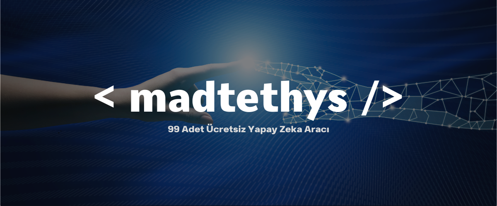

<h2 align="center" style="color:#e63946;text-shadow: 3px 4px 4px rgba(205, 50, 70, 0.7);">99 Adet Ücretsiz Yapay Zeka Aracı  </h2>
</img>
<h4 align="center" style="color:#e63946;text-shadow: 3px 4px 4px rgba(205, 50, 70, 0.7);">Sosyal Medya Üzerinden Beni Takip Edebilirsiniz.  </h4>

    
   
    

  

## Yapay Zeka Nedir?

Yapay Zeka (YZ), insan zekâsının dijital ortamda simüle edilmesi olarak tanımlanabilir. Bilgisayar sistemlerine, insanlar gibi düşünme, öğrenme, problem çözme ve karar verme becerilerini kazandırmayı amaçlar. Yapay zeka, büyük veri, makine öğrenimi, derin öğrenme, doğal dil işleme (NLP) gibi disiplinlerden yararlanarak insan davranışlarını taklit eden algoritmalar geliştirir.

YZ teknolojisi, günümüzde birçok sektörde devrim yaratmış ve farklı alanlarda sayısız uygulamaya sahiptir. Örneğin:
- **Doğal Dil İşleme (NLP)**: İnsan diliyle etkileşime giren chatbot'lar, sanal asistanlar, metin analiz araçları.
- **Görüntü Tanıma**: Yüz tanıma sistemleri, tıbbi görüntü analizi, nesne algılama.
- **Otonom Sistemler**: Sürücüsüz araçlar, robotik süreçler, dronelar.
- **Veri Analizi ve Tahmin**: Büyük veri setlerini analiz eden ve gelecekteki eğilimleri tahmin eden algoritmalar.

## Yapay Zeka Araçları Neden Önemli?

Yapay zeka araçları, karmaşık teknolojik süreçleri basitleştirerek, kullanıcıların YZ yeteneklerinden faydalanmasını sağlar. Bu araçlar, YZ geliştirme sürecini hızlandırırken, aynı zamanda teknik bilgi gerektirmeyen kullanıcılar için bile erişilebilir hale getirir. Kodlama bilgisi olmayan kullanıcılar, sürükle-bırak platformlar ya da hazır modeller kullanarak yapay zeka tabanlı çözümler geliştirebilirler. Bu araçlar sayesinde, iş süreçleri otomatik hale getirilir, daha akıllı veri analitiği yapılabilir, müşteri hizmetleri iyileştirilebilir ve inovasyon hız kazanır.

## Bu Blogda Neler Bulacaksınız?

Bu blog, YZ dünyasına adım atmak isteyenler ve mevcut yapay zeka araçlarını keşfetmek isteyenler için kapsamlı bir rehber niteliğindedir. Aşağıda, en popüler ve etkili yapay zeka araçlarını farklı kategorilerde listeledik. Her bir aracın kullanım alanları, sunduğu avantajlar ve nasıl çalıştığı hakkında bilgi bulacaksınız.

### Kategoriler

1. **Doğal Dil İşleme (NLP) Araçları**  
   Dil modelleme, metin oluşturma, chatbot'lar ve dil anlayışı için kullanılan araçlar.

2. **Görüntü Tanıma ve İşleme Araçları**  
   Bilgisayarla görü, nesne algılama ve tıbbi görüntüleme gibi uygulamalar için geliştirilmiş araçlar.

3. **Makine Öğrenimi ve Derin Öğrenme Araçları**  
   Model geliştirme, veri analizi, tahmin ve sınıflandırma işlemleri için kullanılan araçlar.

4. **Oyun ve Sanat İçin Yapay Zeka Araçları**  
   Sanat, müzik, oyun geliştirme ve yaratıcı içerik üretimi için yapay zeka çözümleri.

5. **İş ve Verimlilik Yapay Zeka Araçları**  
   İş süreçlerinin otomasyonu, müşteri destek sistemleri ve verimlilik artırıcı yapay zeka uygulamaları.

### Yapay Zeka Araçlarını Kullanmanın Faydaları

Yapay zeka araçlarını kullanmak, yalnızca teknik bilgiye sahip kullanıcılar için değil, aynı zamanda bu teknolojilere yeni adım atanlar için de oldukça faydalıdır. Bu araçların bazı avantajları şunlardır:
- **Kolay Entegrasyon**: Çoğu araç, mevcut sistemlere kolayca entegre edilebilir ve kullanıcı dostu arayüzler sunar.
- **Verimlilik Artışı**: Rutin görevlerin otomasyonu ile zaman kazandırır ve insan hatasını minimize eder.
- **Veri Analizinde Güç**: Büyük veri setleri üzerinde analiz yaparak gelecekteki eğilimleri daha doğru tahmin edebilir.
- **Yenilikçi Çözümler**: Yaratıcı projeler için ilham kaynağı olur ve yeni fikirlerin hayata geçirilmesini hızlandırır.

Bu blog, yapay zekanın gücünü keşfetmek isteyen herkes için bir rehber sunmaktadır. Yapay zeka araçlarıyla yapabileceklerinizi keşfetmeye hazır mısınız? Aşağıdaki listeyle başlayın ve her aracı detaylı bir şekilde inceleyin.

 
<h2 align="center" style="color:#e63946;text-shadow: 3px 4px 4px rgba(205, 50, 70, 0.7);">A'dan Z'ye Tüm Yapay Zekalar  </h2>

#### 1- 2short.ai: [Yapay Zekaya ulaşmak için tıkla!](https://2short.ai/)
> Bu araç, uzun videoları kısa ve etkileyici kliplere dönüştürmenizi sağlar. İçerik üreticileri için, dikkat çekici anları hızlı bir şekilde kesip paylaşmak önemlidir. Otomatik düzenleme özellikleri ile zamandan tasarruf sağlar.

#### 2- Adobe Podcast: [Yapay Zekaya ulaşmak için tıkla!](https://podcast.adobe.com/)
> Ses kayıtlarınızı profesyonel bir düzeye getirmek için kullanabileceğiniz bir platformdur. Arka plan gürültüsünü azaltma, ses netliğini artırma ve ses efektleri ekleme gibi özellikler sunarak podcast yayıncılarının işini kolaylaştırır.

#### 3- AI Comic Factory: [Yapay Zekaya ulaşmak için tıkla!](https://huggingface.co/spaces/jbilcke-hf/ai-comic-factory)
> Metinleri çizgi roman formatına dönüştürmenize olanak tanır. Kullanıcılar, hikayelerini görselleştirirken hayal gücünü kullanarak eğlenceli ve ilgi çekici içerikler oluşturabilir.

#### 4- AI Dungeon: [Yapay Zekaya ulaşmak için tıkla!](https://aidungeon.com/)
> Bu platform, kullanıcıların metin tabanlı hikayelerde maceralarını yönlendirmelerine imkan tanır. Herhangi bir hikaye yazımı kurallarına bağlı kalmadan özgürce yazabilir ve anlık tepkiler alabilirsiniz.

#### 5- AI Emoji Generator: [Yapay Zekaya ulaşmak için tıkla!](https://emojis.sh/)
> Kullanıcıların kişisel veya marka bazında özelleştirilmiş emojiler oluşturmalarını sağlar. Sosyal medya etkileşimlerinizi daha eğlenceli ve kişisel hale getirir.

#### 6- Animated Drawings: [Yapay Zekaya ulaşmak için tıkla!](https://sketch.metademolab.com/)
> Statik çizimleri canlandırma yeteneğine sahip bir araçtır. Kullanıcılar, çizimlerini hareketlendirebilir ve bu sayede daha dinamik sanat eserleri ortaya çıkarabilir.

#### 7- askThee: [Yapay Zekaya ulaşmak için tıkla!](https://askthee.vercel.app/)
> Kullanıcıların çeşitli konularda sorularını yanıtlayabilen bir soru cevaplama platformudur. Bilgi edinme sürecini hızlandırır ve öğrenmeyi daha erişilebilir hale getirir.

#### 8- Audiobox: [Yapay Zekaya ulaşmak için tıkla!](https://audiobox.metademolab.com/)
> Müzik ve ses düzenleme platformudur. Kullanıcılar, ses dosyalarını kesip biçimlendirebilir, efektler ekleyebilir ve daha kaliteli ses içerikleri üretebilir.

#### 9- AutoDraw: [Yapay Zekaya ulaşmak için tıkla!](https://www.autodraw.com/)
> Çizimlerinizi otomatik olarak tanıyıp düzelten bir araçtır. Hızlı ve basit çizimlerinizi daha profesyonel hale getirir.

#### 10- Bark: [Yapay Zekaya ulaşmak için tıkla!](https://huggingface.co/spaces/suno/bark)
> Metinleri sesli hale dönüştüren bir uygulamadır. Kullanıcılar, yazılı içeriklerini sesli olarak paylaşarak daha geniş bir kitleye ulaşabilir.

#### 11- Black Forest Labs: [Yapay Zekaya ulaşmak için tıkla!](https://blackforestlabs.ai/)
> Metinden görsel üretimi yapar. Tasarımcılar ve içerik üreticileri için görsel içerik oluşturmakta oldukça yardımcıdır.

#### 12- Blockade Labs: [Yapay Zekaya ulaşmak için tıkla!](https://www.blockadelabs.com/)
> Kullanıcıların 3D ortamlar oluşturmasına yardımcı olan bir platformdur. Oyun tasarımcıları ve mimarlar için yaratıcı projeler geliştirmek adına faydalıdır.

#### 13- Canva: [Yapay Zekaya ulaşmak için tıkla!](https://www.canva.com/)
> Çok yönlü bir grafik tasarım aracıdır. Sosyal medya gönderilerinden broşürlere kadar çeşitli görsel içerikler oluşturmak için kullanıcı dostu bir arayüz sunar.

#### 14- Capcut: [Yapay Zekaya ulaşmak için tıkla!](https://www.capcut.com/tr-tr/tools/ai-image-upscaler)
> Video düzenleme aracı olarak, kullanıcıların videolarını kesip düzenlemelerine olanak tanır. Özellikle sosyal medya içerikleri için hızlı çözümler sunar.

#### 15- character.ai: [Yapay Zekaya ulaşmak için tıkla!](https://character.ai/)
> Sohbet robotlarıyla etkileşimde bulunmanızı sağlar. Kişisel asistan olarak kullanabilir veya eğlenceli bir sohbet deneyimi yaşayabilirsiniz.

#### 16- ChatGPT: [Yapay Zekaya ulaşmak için tıkla!](https://chatgpt.com/)
> Metin tabanlı sohbet ve bilgi edinme platformudur. Kullanıcılar, sorularını sorarak geniş bir bilgi yelpazesine erişebilir.

#### 17- Claude.ai: [Yapay Zekaya ulaşmak için tıkla!](https://claude.ai/)
> Gelişmiş bir sohbet robotudur. Karmaşık sorulara yanıt vermek üzere tasarlanmıştır ve doğal dil işleme yetenekleri ile dikkat çeker.

#### 18- Cleanup.pictures: [Yapay Zekaya ulaşmak için tıkla!](https://cleanup.pictures/)
> Görsellerdeki istenmeyen nesneleri hızlı bir şekilde kaldırmanızı sağlar. Fotoğraflarınızı daha temiz ve profesyonel bir hale getirir.

#### 19- ClipDrop: [Yapay Zekaya ulaşmak için tıkla!](https://clipdrop.co/)
> Görselleri hızlı bir şekilde kesip başka görsellere eklemenizi sağlar. Kullanıcıların görsel içeriklerini hızlıca zenginleştirmelerine yardımcı olur.

#### 20- Color Pop AI: [Yapay Zekaya ulaşmak için tıkla!](https://colorpop.ai/)
> Görsel oluşturma ve renklendirme işlevi sunar. Sanat projelerinizde ilham almak için harika bir kaynak.

#### 21- ColorMagic: [Yapay Zekaya ulaşmak için tıkla!](https://colormagic.app/)
> Tasarım projeleriniz için özelleştirilmiş renk paletleri oluşturmanıza yardımcı olur. Estetik tasarımlar için doğru renk uyumunu yakalamanızı sağlar.

#### 22- Copilot: [Yapay Zekaya ulaşmak için tıkla!](https://copilot.microsoft.com/)
> Yazılım geliştirme süreçlerinde kullanıcıya yardımcı olan bir asistanıdır. Kod yazımında önerilerde bulunarak iş akışını hızlandırır.

#### 23- Decohere: [Yapay Zekaya ulaşmak için tıkla!](https://www.decohere.ai/)
> Gerçek zamanlı görsel üretimi sağlar. Yaratıcı projeler için hızlı ve etkili çözümler sunar.

#### 24- DeepAI: [Yapay Zekaya ulaşmak için tıkla!](https://deepai.org/)
> Kullanıcılara metinden görsele dönüşüm yapma imkanı tanır. Görsel içerik üretimi için oldukça etkilidir.

#### 25- DeepL: [Yapay Zekaya ulaşmak için tıkla!](https://www.deepl.com/)
> Yüksek kaliteli çeviri hizmetleri sunarak çok dilli içeriklerin oluşturulmasını kolaylaştırır. Kullanıcılar, çeşitli dillerde yüksek doğrulukta çeviriler elde edebilir.

#### 26- Detect Face Shape: [Yapay Zekaya ulaşmak için tıkla!](https://www.detect-face-shape.com/)
> Kullanıcıların yüz şekillerini analiz eder ve kişisel stil önerileri sunar. Moda alanında daha bilinçli tercihler yapmanıza yardımcı olur.

#### 27- Dolby On: [Yapay Zekaya ulaşmak için tıkla!](https://www.dolby.com/apps/dolby-on)
> Ses kaydı ve iyileştirme platformudur. Müzik ve podcast prodüksiyonunda ses kalitesini artırarak profesyonel sonuçlar elde etmenizi sağlar.

#### 28- ElevenLabs: [Yapay Zekaya ulaşmak için tıkla!](https://elevenlabs.io/)
> Ses klonlama ve metinden konuşmaya dönüşüm yapar. Kullanıcılar, özelleştirilmiş sesli içerikler oluşturabilir.

#### 29- Face Swapper: [Yapay Zekaya ulaşmak için tıkla!](https://faceswapper.ai/)
> Görsellerde yüz değiştirme işlevi sunar. Eğlenceli içerikler üretmek için kullanılabilir.

#### 30- Fal.ai: [Yapay Zekaya ulaşmak için tıkla!](https://fal.ai/models/fal-ai/retoucher)
> Görsel rötuş yapma yeteneğine sahiptir. Fotoğraflarınızı daha profesyonel bir görünüm kazandırır.

#### 31- Flair AI: [Yapay Zekaya ulaşmak için tıkla!](https://flair.ai/)
> Markalı içerik tasarımı yaparak sosyal medya ve pazarlama projelerinde estetik çözümler sunar.

#### 32- Fontjoy: [Yapay Zekaya ulaşmak için tıkla!](https://fontjoy.com/)
> Farklı yazı tiplerini eşleştirerek tasarım projelerinizde uyum sağlamanıza yardımcı olur. Estetik açıdan etkileyici görseller yaratmanıza olanak tanır.

#### 33- Framer: [Yapay Zekaya ulaşmak için tıkla!](https://framer.com/)
> Web sitesi tasarımı için kapsamlı bir platformdur. Kullanıcı dostu arayüzü sayesinde hızlı ve etkili prototipler oluşturabilirsiniz.

#### 34- Freepik Pikaso: [Yapay Zekaya ulaşmak için tıkla!](https://www.freepik.com/pikaso)
> Metinden görsel üretme yeteneği sunar. Tasarım projeleriniz için hızlı ve yaratıcı çözümler sunar.

#### 35- Gemini: [Yapay Zekaya ulaşmak için tıkla!](https://gemini.google.com/)
> Sohbet robotu olarak bilgi alışverişi yapar. Kullanıcıların farklı konularda etkileşimde bulunmasını sağlar.

#### 36- Genmo: [Yapay Zekaya ulaşmak için tıkla!](https://www.genmo.ai/)
> Metinden videoya dönüşüm yapar. Kısa ve etkileyici videolar oluşturmak isteyenler için idealdir.

#### 37- GenType: [Yapay Zekaya ulaşmak için tıkla!](https://labs.google/gentype)
> Kullanıcıların kişiselleştirilmiş fontlar oluşturmasına yardımcı olur. Tasarım projelerinde özgün yazı tipleri bulmanıza olanak tanır.

#### 38- Haiper: [Yapay Zekaya ulaşmak için tıkla!](https://haiper.ai/)
> Metinden videoya dönüşüm işlevi sunar. İçerik üretiminde zaman kazandırır ve hızlı çözümler sunar.

#### 39- Hedra: [Yapay Zekaya ulaşmak için tıkla!](https://www.hedra.com/)
> Görsel oluşturma ve canlandırma yeteneği ile sanatsal projelerinizde yaratıcı alternatifler sunar.

#### 40- Ideogram: [Yapay Zekaya ulaşmak için tıkla!](https://ideogram.ai/)
> Metinleri görsellere dönüştürerek anlatımınızı zenginleştirir. Kullanıcılar, fikirlerini daha görsel bir şekilde ifade edebilir.

#### 41- IllusionDiffusion: [Yapay Zekaya ulaşmak için tıkla!](https://huggingface.co/spaces/AP123/IllusionDiffusion)
> İllüzyon görselleri üreterek sanatsal projelere ilham kaynağı olur. Farklı ve özgün görseller oluşturmak için kullanılabilir.

#### 42- ImageFX: [Yapay Zekaya ulaşmak için tıkla!](https://aitestkitchen.withgoogle.com/tools/image-fx)
> Görsel içerik üretimi için metinden görüntü oluşturma yeteneği sunar. Kullanıcılar, görsellerini hızlıca zenginleştirebilir.

#### 43- Imagewith.AI: [Yapay Zekaya ulaşmak için tıkla!](https://overscale.imagewith.ai/)
> Görsellerin kalitesini artırarak daha profesyonel hale getirilmesini sağlar. Fotoğraflarınıza derinlik ve netlik kazandırır.

#### 44- Immersity AI: [Yapay Zekaya ulaşmak için tıkla!](https://immersity.ai/)
> 2D görüntüleri 3D'ye dönüştürerek görsel projelerinizi zenginleştirir. Oyun ve animasyon projeleri için faydalıdır.

#### 45- Insta 3D: [Yapay Zekaya ulaşmak için tıkla!](https://huggingface.co/spaces/AchyuthGamer/Insta-3D)
> Kullanıcıların 2D'den 3D'ye dönüşüm yapmasına olanak tanır. Yaratıcı projelerinizde farklı bir boyut kazandırır.

#### 46- immerse.zone: [Yapay Zekaya ulaşmak için tıkla!](https://www.immerse.zone/)
> Görsel içeriklerin tersine arama işlemlerini gerçekleştirerek, kullanıcıların görsel kaynaklarını bulmasına yardımcı olur.

#### 47- Khroma: [Yapay Zekaya ulaşmak için tıkla!](https://www.khroma.co/)
> Renk paletleri oluşturma aracı olarak tasarım projelerinizde uyumlu renkler bulmanıza yardımcı olur. Farklı kombinasyonları denemenizi sağlar.

#### 48- KREA: [Yapay Zekaya ulaşmak için tıkla!](https://www.krea.ai/apps/image/realtime)
> Gerçek zamanlı görüntü üretimi ile yaratıcı projelerinizi hızlandırır. Kullanıcılar, anında görsel içeriklere ulaşabilir.

#### 49- LALAL.AI: [Yapay Zekaya ulaşmak için tıkla!](https://www.lalal.ai/)
> Ses dosyalarındaki vokalleri ayırmak için kullanılan bir platformdur. Müzik prodüksiyonunda sesleri temizleme işlevi sunar.

#### 50- Let’s Enhance: [Yapay Zekaya ulaşmak için tıkla!](https://letsenhance.io/)
> Görsellerin çözünürlüğünü artırarak daha kaliteli hale getiren bir araçtır. Fotoğraflarınızın detaylarını vurgular.

#### 51- Magical: [Yapay Zekaya ulaşmak için tıkla!](https://www.getmagical.com/ai)
> Belirli metinlerdeki bilgileri analiz ederek içerik üretimini kolaylaştırır. Hızlı bilgi edinme ve içerik oluşturma için kullanışlıdır.

#### 52- Magic Eraser: [Yapay Zekaya ulaşmak için tıkla!](https://magicstudio.com/tr/magiceraser/)
> Görsellerdeki istenmeyen nesneleri silme işlevi sunar. Fotoğraflarınızı daha temiz bir hale getirir.

#### 53- Meme Generator: [Yapay Zekaya ulaşmak için tıkla!](https://www.supermeme.ai/)
> Kullanıcıların özgün meme içerikleri oluşturmalarına olanak tanır. Sosyal medya paylaşımlarınızı daha eğlenceli hale getirir.

#### 54- Mentor AI: [Yapay Zekaya ulaşmak için tıkla!](https://www.mymentorai.com/)
> Öğrenme ve gelişim süreçlerinde kişisel rehberlik sağlar. Kullanıcılar, ihtiyaçlarına göre özelleştirilmiş bilgiler alabilir.

#### 55- MidJourney: [Yapay Zekaya ulaşmak için tıkla!](https://www.midjourney.com/home)
> Metinden yüksek kaliteli görseller üreten bir platformdur. Tasarımcılar için ilham kaynağı olabilir.

#### 56- Mistral: [Yapay Zekaya ulaşmak için tıkla!](https://mistral.ai/)
> Gelişmiş dil işleme özellikleri ile metin analizleri yapar. Kullanıcıların içeriklerini daha etkili bir şekilde organize etmelerine yardımcı olur.

#### 57- Neural.love: [Yapay Zekaya ulaşmak için tıkla!](https://neural.love/)
> Sanat projelerinde yaratıcılığı artırmak için kullanışlı bir platformdur. Farklı sanat stillerinde görseller oluşturur.

#### 58- NightCafe: [Yapay Zekaya ulaşmak için tıkla!](https://creator.nightcafe.studio/)
> Metin tabanlı sanat projeleri için görsel oluşturma aracı olarak kullanılabilir. Yaratıcı sanat eserleri için ilham kaynağıdır.

#### 59- OpenAI Codex: [Yapay Zekaya ulaşmak için tıkla!](https://openai.com/index/openai-codex/)
> Yazılım geliştirme süreçlerini hızlandıran bir araçtır. Kullanıcılara kod önerileri sunarak geliştirme sürecini kolaylaştırır.

#### 60- OpenArt: [Yapay Zekaya ulaşmak için tıkla!](https://openart.ai/)
> Görsel sanatta yaratıcı projeler geliştirmek için kullanılabilir. Kullanıcıların sanatsal içerik oluşturmasını destekler.

#### 61- Pencil2D: [Yapay Zekaya ulaşmak için tıkla!](https://www.pencil2d.org/)
> Animasyon projeleri için kullanıcı dostu bir arayüz sunar. Çizimlerinizi hareketlendirme imkanı tanır.

#### 62- MyLens.AI: [Yapay Zekaya ulaşmak için tıkla!](https://mylens.ai/)
> Metin tabanlı taslak oluşturma yeteneği sunar. Yaratıcılığınızı desteklerken zamandan tasarruf etmenizi sağlar.

#### 63- Namelix: [Yapay Zekaya ulaşmak için tıkla!](https://namelix.com/)
> İşletme adı oluşturucu olarak, yeni projeler için ilham kaynağıdır. Kullanıcılar, yaratıcı ve akılda kalıcı isimler bulabilir.

#### 64- Namy.ai: [Yapay Zekaya ulaşmak için tıkla!](https://namy.ai/)
> Alan adı oluşturma aracı olarak, web siteniz için uygun isim bulmanıza yardımcı olur. İnternet projelerinizi hayata geçirmek için faydalıdır.

#### 65- Notion: [Yapay Zekaya ulaşmak için tıkla!](https://www.notion.so/)
> Not alma ve verimlilik aracı olarak, organizasyon ve iş yönetimi için çok yönlü bir platformdur. Farklı projeleri yönetmek için ideal bir ortam sunar.

#### 66- OutfitAnyone: [Yapay Zekaya ulaşmak için tıkla!](https://humanaigc.github.io/outfit-anyone/)
> Sanal kıyafet deneme imkanı sunar. Moda projeleri ve alışveriş deneyimlerini zenginleştirir.

#### 67- Palette.fm: [Yapay Zekaya ulaşmak için tıkla!](https://palette.fm/)
> Görsel renklendirme aracı olarak, fotoğraflarınıza farklı renk tonları eklemenizi sağlar. Sanat projelerinizde yaratıcı dokunuşlar yapmanıza olanak tanır.

#### 68- Perplexity AI: [Yapay Zekaya ulaşmak için tıkla!](https://www.perplexity.ai/)
> Gelişmiş arama motoru olarak, kullanıcıların ihtiyaç duyduğu bilgilere hızlı erişim sağlar. İnternet üzerinde bilgi edinmeyi kolaylaştırır.

#### 69- Pi: [Yapay Zekaya ulaşmak için tıkla!](https://pi.ai/onboarding)
> Sohbet robotu olarak kullanıcılarla etkileşimde bulunur. Kişisel asistan olarak kullanılabilir, çeşitli konularda yardımcı olabilir.

#### 70- Pika: [Yapay Zekaya ulaşmak için tıkla!](https://pika.art/home)
> Metinden videoya dönüşüm yapar. İçerik üretiminde hız kazandırır ve yaratıcı projelerinizi zenginleştirir.

#### 71- pinokio: [Yapay Zekaya ulaşmak için tıkla!](https://pinokio.computer/)
> Birden fazla yapay zeka aracını bir araya getirir. Çeşitli projeler için farklı çözümler sunar.

#### 72- PixVerse: [Yapay Zekaya ulaşmak için tıkla!](https://app.pixverse.ai/login)
> Görüntü düzenleme ve üretim aracı olarak, sosyal medya paylaşımlarınız için etkileyici görseller oluşturmanıza yardımcı olur.

#### 73- Playground: [Yapay Zekaya ulaşmak için tıkla!](https://playground.com/)
> Metinden görsel üretimi imkanı sunar. Yaratıcılığınızı artırarak etkileyici içerikler oluşturmanıza olanak tanır.

#### 74- PlayHT: [Yapay Zekaya ulaşmak için tıkla!](https://play.ht/)
> Metinleri sesli hale dönüştürür. Sesli içerikler oluşturmanıza ve paylaşmanıza yardımcı olur.

#### 75- PlayPhrase.me: [Yapay Zekaya ulaşmak için tıkla!](https://playphrase.me/)
> Film repliklerini bulmanıza yardımcı olur. Eğlenceli içerik üretimi için ilginç bir kaynak sağlar.

#### 76- Poe: [Yapay Zekaya ulaşmak için tıkla!](https://poe.com/login)
> Farklı sohbet robotlarına erişim sağlar. Kullanıcılar, kapsamlı bilgi edinme deneyimi yaşayabilir.

#### 77- Profile Pic Maker: [Yapay Zekaya ulaşmak için tıkla!](https://picofme.io/)
> Profil resmi oluşturma aracı olarak, sosyal medya hesaplarınız için özgün görseller tasarlamanıza yardımcı olur.

#### 78- QR Code AI Art Generator: [Yapay Zekaya ulaşmak için tıkla!](https://huggingface.co/spaces/huggingface-projects/QR-code-AI-art-generator)
> QR kodları üretir. Etkinliklerde veya projelerde kolayca kullanılabilir.

#### 79- QuillBot: [Yapay Zekaya ulaşmak için tıkla!](https://quillbot.com/)
> Metni yeniden yazma ve dil bilgisi kontrolü yaparak, yaratıcı içeriklerinizi destekler.

#### 80- Recraft: [Yapay Zekaya ulaşmak için tıkla!](https://www.recraft.ai/)
> Görsel oluşturma ve düzenleme aracı olarak, tasarım projeleri için faydalı bir platformdur.

#### 81- Remove.bg: [Yapay Zekaya ulaşmak için tıkla!](https://www.remove.bg/)
> Görsellerin arka planını kaldırarak, fotoğraflarınızı daha profesyonel hale getirir.

#### 82- Replicate: [Yapay Zekaya ulaşmak için tıkla!](https://replicate.com/home)
> Birden fazla yapay zeka aracını kullanıma sunarak, farklı projeler için çözümler sunar.

#### 83- Runway: [Yapay Zekaya ulaşmak için tıkla!](https://runwayml.com/)
> Video düzenleme ve içerik oluşturma aracı olarak, film ve video prodüksiyonunda yardımcı olur.

#### 84- Scribble Diffusion: [Yapay Zekaya ulaşmak için tıkla!](https://www.scribblediffusion.ai/)
> Karalamaları görsellere dönüştürerek, yaratıcı projeler için eğlenceli bir araç sağlar.

#### 85- Seamless Streaming: [Yapay Zekaya ulaşmak için tıkla!](https://huggingface.co/spaces/facebook/seamless-streaming)
> Sesli gerçek zamanlı çeviri yaparak, çok dilli içerikler oluşturmanıza yardımcı olur.

#### 86- Semantic Scholar: [Yapay Zekaya ulaşmak için tıkla!](https://www.semanticscholar.org/)
> Araştırma ve akademik içerik bulma aracı olarak, bilimsel çalışmalara erişim sağlar.

#### 87- Socratic: [Yapay Zekaya ulaşmak için tıkla!](https://socratic.org/)
> Öğrencilerin anlamadığı konularda yardım almasına olanak tanır. Ödev yardımı ve konu açıklamaları sunar.

#### 88- Stable Diffusion: [Yapay Zekaya ulaşmak için tıkla!](https://stability.ai/stable-image)
> Online görsel üretimi yaparak, yüksek kaliteli görseller elde etmek için kullanılır. Kullanıcıların yaratıcı projelerini destekler.

#### 89- StarryAI: [Yapay Zekaya ulaşmak için tıkla!](https://starryai.com/)
> Metinden görsel üretme yeteneği ile, sanatsal projelerinizi zenginleştirir. Yaratıcılığınızı ortaya çıkarır.

#### 90- Suno: [Yapay Zekaya ulaşmak için tıkla!](https://suno.com/)
> Metinlerden müzik parçaları oluşturarak, müzik projelerinize yeni bir boyut kazandırır.

#### 91- TextFX: [Yapay Zekaya ulaşmak için tıkla!](https://www.textfx.co/)
> Metin efektleri oluşturma aracı olarak, içeriklerinizi daha çekici hale getirir.

#### 92- TinEye: [Yapay Zekaya ulaşmak için tıkla!](https://tineye.com/)
> Tersine görsel arama yaparak, görsellerin kökenini bulmanıza yardımcı olur. Görsel kaynaklarınızı keşfetmenize olanak tanır.

#### 93- TinyWow: [Yapay Zekaya ulaşmak için tıkla!](https://tinywow.com/)
> Çeşitli araçlar sunarak kullanıcıların işlerini kolaylaştırır. Farklı ihtiyaçlar için pratik çözümler sağlar.

#### 94- Upscayl: [Yapay Zekaya ulaşmak için tıkla!](https://upscayl.org/)
> Görsel kalitesini artırarak, fotoğraflarınızın çözünürlüğünü yükseltir. Daha profesyonel bir görünüm elde etmenize yardımcı olur.

#### 95- v0: [Yapay Zekaya ulaşmak için tıkla!](https://v0.dev/chat)
> Kullanıcı arayüzü oluşturma aracı olarak, web ve mobil uygulama tasarımı için idealdir. Hızlı prototipler oluşturmanızı sağlar.

#### 96- Vercel AI SDK: [Yapay Zekaya ulaşmak için tıkla!](https://sdk.vercel.ai/)
> Yazılım geliştirme projelerinde farklı sohbet robotlarına erişim sağlar. Kullanıcılar, yazılım süreçlerini hızlandırabilir.

#### 97- Vocal Remover: [Yapay Zekaya ulaşmak için tıkla!](https://vocalremover.org/)
> Müzikten vokalleri kaldırarak, sesleri ayırma imkanı sunar. Müzik prodüksiyonunda yararlı bir araçtır.

#### 98- Whisper: [Yapay Zekaya ulaşmak için tıkla!](https://openai.com/index/whisper/)
> Konuşmaları metne dönüştürme işlevi sunarak, sesli içerikleri yazılı hale getirmek için kullanılır. Bilgi edinme sürecini hızlandırır.

#### 99- Zarla AI: [Yapay Zekaya ulaşmak için tıkla!](https://www.zarla.com/)
> Web sitesi oluşturma aracı olarak, kullanıcıların hızlı ve kolay bir şekilde web siteleri tasarlamalarını sağlar. Kullanıcı dostu arayüzü ile projelerinizi hayata geçirir.

## Sonuç

Yapay zeka, hızla gelişen bir teknoloji alanı olarak, neredeyse her sektörde etkili çözümler sunmaya devam ediyor. Bu blogda tanıttığımız araçlar, YZ'nin gücünden yararlanarak projelerinizi bir adım öteye taşımanıza yardımcı olabilir. İster doğal dil işleme araçlarıyla dil bariyerlerini aşın, ister makine öğrenimi araçlarıyla veri analizlerinizi optimize edin, bu çözümlerle sınırlarınızı zorlayabilirsiniz.

Bu araçların her biri, kullanıcılarına karmaşık yapay zeka süreçlerini daha basit ve erişilebilir hale getirme amacı taşır. Bu nedenle, ihtiyacınıza uygun aracı seçip, yapay zeka ile yaratıcı projeler geliştirmeye hemen başlayabilirsiniz.

**Unutmayın**, yapay zeka teknolojileri sürekli gelişiyor ve yeni araçlar ortaya çıkıyor. Bu yüzden, bu blogu düzenli olarak güncellemeyi planlıyoruz, böylece en güncel yapay zeka çözümleri hakkında bilgi sahibi olabilirsiniz.

Teknolojinin bu heyecan verici dünyasına katılın ve yapay zeka araçlarını kullanarak geleceği bugünden şekillendirin!

## Yazar
- Mustafa Arda Düşova

